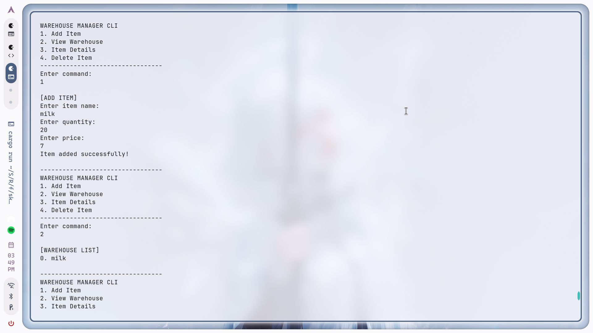

# Warehouse Manager CLI 📦

A simple command-line interface (CLI) tool for managing warehouse inventory. Built with **Rust** to practice vectors, structs, and ownership concepts.



## Features

* **Add Item:** Add new products with name, quantity, and price.
* **View Inventory:** List all items currently in stock.
* **Item Details:** View detailed information about a specific item by its index.
* **Delete Item:** Remove items from the inventory.
* **Input Validation:** Basic protection against invalid inputs (prevents crashes).

## How to Run

Make sure you have [Rust and Cargo](https://www.rust-lang.org/tools/install) installed.

1. Clone the repository:
   ```bash
   git clone [https://github.com/YOUR_USERNAME/rust-warehouse-cli.git](https://github.com/TemirlanVinci/rust-warehouse-cli.git)
2. Navigate to the project folder.
3. Run the game. (cargo run)